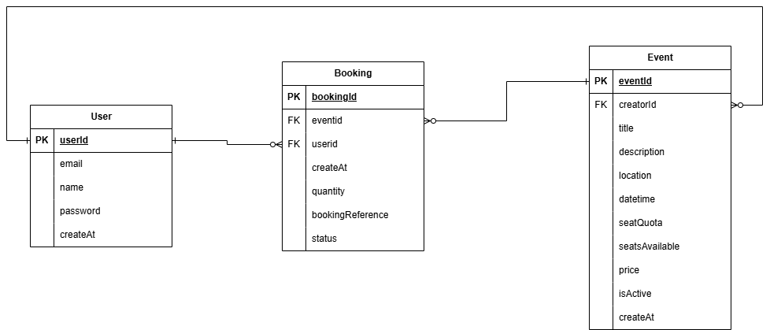

# Event Booking Management API

A RESTful backend service for managing events and ticket bookings, built for the PT Agora Techno Solution Backend Developer Challenge. This API simulates the core functionality of an event ticketing platform, allowing users to browse events, securely book tickets, and manage their reservations.

## Tech Stack
* **Language:** Java 21
* **Framework:** Spring Boot 3.x
* **Build Tool:** Gradle
* **Database:** PostgreSQL
* **Containerization:** Docker & Docker Compose
* **Security:** Spring Security & JWT Authentication
* **Database Migration:** Flyway (includes initial schema and data seeding)

## Architecture & Project Structure
This project enforces a clean, layered architecture to maintain clear project boundaries and strict separation of concerns, ensuring high maintainability:
* **Controller Layer:** Handles incoming HTTP requests, input validation, and API routing.
* **Service Layer:** Contains core business logic, orchestration, and transaction management.
* **Repository Layer:** Manages database interactions via Spring Data JPA.
* **Entity Layer:** Represents database models mapped to PostgreSQL tables.
* **DTO Layer:** Data Transfer Objects to separate API contracts from internal database models.

## Database Schema & Constraints
The application uses PostgreSQL. The schema is automatically generated and seeded using Flyway migrations upon application startup.



### Entities Overview
1. **User:** Stores credentials and profile details. Emails are constrained as UNIQUE.
2. **Event:** Manages event capacity and schedules. Tied to a `creatorId` (User) to ensure modification rights. Uses an `isActive` flag for soft deletion.
3. **Booking:** The transactional entity mapping Users to Events. Contains a UNIQUE `bookingReference` generated upon successful reservation.

## Setup & Installation

### Prerequisites
* Docker and Docker Compose installed on your machine.
* (Optional) Java 21 and Gradle if running locally without Docker.

### Running the Application via Docker (Recommended)
1. **Clone the repository**
   ```bash
   git clone https://github.com/fahri22002/eventbooking.git
   cd eventbooking
   ```

2. **Environment Configuration**
   Copy the example environment file and configure your credentials.
   ```bash
   cp .env.example .env
   ```
   *Open the `.env` file and ensure the database credentials and JWT secret are set.*

3. **Start the Infrastructure and Application**
   This command will start the PostgreSQL database and the Spring Boot application container simultaneously. Flyway will automatically run the migrations and seed the initial data.

   (This command will start the PostgreSQL database container and pull the pre-built Spring Boot API container directly from Docker Hub.)
   ```bash
   docker-compose up -d
   ```

4. **Verify the Application**
   The API will be accessible at `http://localhost:8080`.

## API Documentation & Endpoint Summary
The API is fully documented using OpenAPI/Swagger. Once the application is running, you can access the interactive documentation via browser:
* **Swagger UI:** `http://localhost:8080/swagger-ui/index.html`

### Core Endpoints
* **Auth:** 
    * `POST /api/auth/register` - Register a new user
    * `POST /api/auth/login` - Authenticate and receive JWT
* **User:**
    * `GET /api/user` - Get authenticated user profile
* **Events:**
    * `POST /api/events` - Create a new event
    * `GET /api/events` - List upcoming events (supports pagination)
    * `GET /api/events/search` - Search and filter events using query parameters (`title`, `location`, `creatorName`, `startDate`, `endDate`, `showPast`) and pagination
    * `GET /api/events/{id}` - Get event details
    * `PUT /api/events/{id}` - Update an event (Creator only)
    * `DELETE /api/events/{id}` - Soft delete an event (Creator only)
* **Bookings:**
    * `POST /api/bookings` - Create a booking
    * `GET /api/bookings` - List authenticated user's bookings
    * `DELETE /api/bookings/{id}` - Cancel a booking

## Postman Collection
For manual testing, a Postman collection has been provided in the repository.
* **Location:** `docs/Agora_EventBooking_API.postman_collection.json`
* **Instructions:** Import the JSON file into your Postman workspace. Ensure you run the Login request first to acquire the JWT token, which can be configured as a Bearer Token variable for subsequent requests.

## Design Decisions & Trade-offs

### 1. Concurrency Handling for Bookings
To prevent overselling tickets during high-traffic booking requests, the system utilizes database-level atomic updates instead of pessimistic locking.
* **Implementation:** The `decreaseSeatQuota` repository method executes a direct `UPDATE` query that decrements the `seatsAvailable` counter only if the requested quantity is less than or equal to the current available seats.
* **Trade-off:** This approach is highly performant and prevents deadlocks compared to explicit row-level locks (Pessimistic Write). If the update returns `0` affected rows, the service safely aborts the transaction and throws an exception, notifying the user that the seats are sold out.

### 2. Double Booking Prevention
The system enforces a strict check via `bookingRepository.existsByUser_EmailAndEvent_EventIdAndStatus` to ensure a user cannot hold multiple confirmed bookings for the same event, adhering to the business requirements.

### 3. Global Error Handling
A `@RestControllerAdvice` intercepts all application exceptions (e.g., Validation, Unauthorized, Resource Not Found) and maps them to a standardized JSON error response. This ensures API consumers receive consistent and predictable error formats with appropriate HTTP status codes.

### 4. UUID over Auto-Increment IDs
Primary keys for Events and Bookings are generated using UUIDs. This prevents ID guessing attacks (Insecure Direct Object Reference) and provides better scalability in distributed systems, trading off slightly larger index sizes.

### 5. Separation of Search Endpoint (FR-09)
While the specification (FR-09) suggested implementing query parameters (title, location, and date range) directly on the main list endpoint, I deliberately separated the search functionality into its own dedicated `GET /api/events/search` endpoint. This decision was made to accommodate additional complex filters that I introduced (such as `creatorName` and `showPast` toggles) without cluttering the primary `getAllEvents` method. This approach ensures a cleaner API contract and strictly adheres to the Single Responsibility Principle, separating basic pagination browsing from complex dynamic filtering.

### 6. Separation of Auth and User Controllers
For the User Management requirements (FR-01, FR-02, FR-03), I separated the endpoints into two distinct controllers: `AuthController` and `UserController`. While a single controller could technically handle all user-related requests, splitting them strictly enforces the Single Responsibility Principle. The `AuthController` (`/api/auth/*`) is solely responsible for security operations, credential validation, and JWT generation. Meanwhile, the `UserController` (`/api/user`) is dedicated to resource retrieval and managing the authenticated user's profile data.

## Assumptions Made
1. **Event Visibility:** Past events are automatically filtered out from the default `GET /api/events` list, as users typically only browse upcoming events.
2. **Cancellation Policy:** A booking can only be canceled if the current time is strictly before 24 hours of the event's scheduled date. Canceled bookings will automatically return the booked seats back to the event's available pool.
3. **Soft Deletion:** When an event is deleted, it is marked as `isActive = false` rather than physically dropped from the database. This preserves historical booking data and integrity constraints.